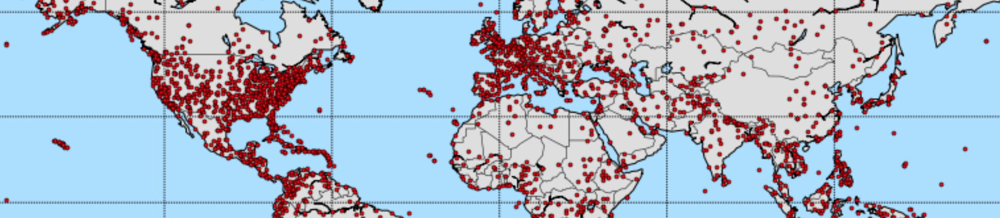

Plane Crash Info
================



Introduction
------------

This is an exploration of data found at http://planecrashinfo.com, a site that collects a lot of data about plane crashes 
back to ca. 1920. While it does a great job at collecting that data it presents only few plots trying to help 
with interpreting it. This notebook attempts to provide the means for easily accessing the data and exploring 
it using a more analytic/interactive/visual approach. To do so, standard tools from a 
Python-based data science stack are used, like [Jupyter] (http://jupyter.org), [Pandas] (http://pandas.pydata.org), 
and [Matplotlib] (http://www.matplotlib.org)/[Basemap] (http://matplotlib.org/basemap/).

**N.B.** This is work in progress… If you have any suggestion, please feel free to raise an issue or provide a pull request.


Installation
------------

Using Python 3 is recommended, because this is the future! And [Conda](http://conda.pydata.org/docs/using/index.html) 
is the recommended packaging system, since Pip cannot install Basemap. To install all dependencies, 
just run the following in your root environment:

```sh
make init
source activate planes
```

Preparation
-----------

For the notebook to execute correctly it needs two data files, both included in this repo, ``data.csv`` and ``geolocs.json``. 
These can also be created by running the following commands, respectively:

```sh
python build_database.py
python build_geolocations.py
```

This might take quite a while, ca. 1-2 hours, and create a few additional CSV files, which are not needed for the notebook, but can be nice to play with.


Exploration
-----------

To get started exploring the data, just run the Jupyter notebook as follows:

```sh
jupyter-notebook planecrashinfo.ipynb
```
